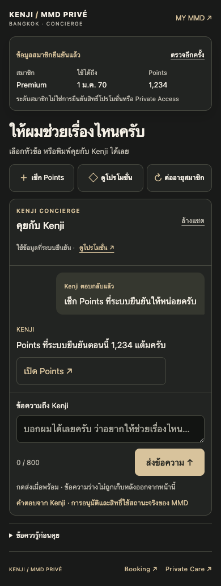
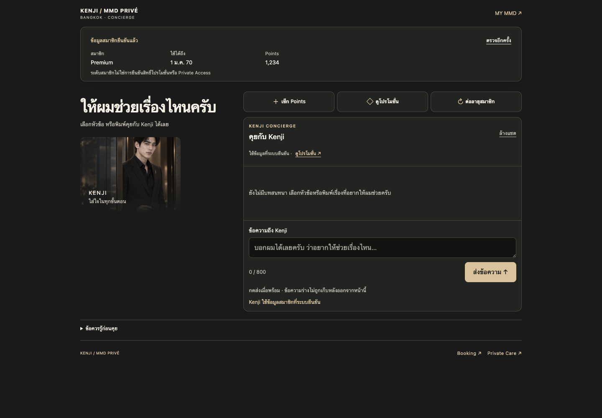

# Compact mobile-first follow-up

Base main `130d8608`, retains merged LIFF/profile/reply contracts. The page now prioritizes member status, three compact quick prompts and chat. Removed repeated hero CTA, standalone explanatory sections and duplicate service nav; safety/takeover/eligibility information is in one collapsed disclosure with historical anchor IDs retained. Desktop uses a smaller portrait and bounded two-column layout.

- 27 focused tests pass; script/backend contract unchanged.
- 76 mock browser checks pass in locally reconstructed published shell with staged substitutions at320/375/390/430/1440, including compact height, 44px targets, duplicate send guard, unknown/zero, session loss and mocked takeover.
- Initial screenshots are under1100px mobile and950px desktop; interactive-state measurements ~897–934px mobile,875px desktop. No customer data.
- External Webflow/analytics/font resources blocked; WebFont stubbed. Actual Designer, native device and authenticated-session acceptance is not claimed.
- Four staged parts read back. `kenji-concierge-v3-shell.html` documents page-only body reset, account-chip suppression and viewport-fit=cover; global custom code untouched.
- Designer MCP disconnected. Actual preview requires the owner to open the supplied Designer MCP link. Metadata update failed because connector schema rejects documented `data` field; old SEO/OG claims are still unchanged pending supported update/manual reconciliation.
- Publishing tool supports optional pageId, but this site's Enterprise/Single Page Publishing enablement could not be verified read-only. No publication attempted.

## Historical implementation evidence

# Kenji UI QA — mocked local preview

Isolated clone based on `31abd3eb891c6970357415f315a528157156004b`; no unrelated checkout or release folder was modified. No repository AGENTS.md or local `.agents/skills` was present. README-FIRST.md and local Codex safety instructions were inspected. Local memory was read only; no memory write.

## LIFF contract recovery

Follow-up based on merged main `d308255ec9797d3b36877111254df90410c851b3`. The original browser fixture incorrectly modeled nested membership/confirmedBalance fields and missed the actual flat LIFF contract. The earlier 23 focused tests and 58 browser checks were not evidence that this contract worked.

- Recovery tests: **104 passed**, including actual customer-360 serializer, payment-backed Points guard, LIFF identity tests and frontend/chat tests.
- Recovery browser: **68 checks passed**, 8 intercepted mock POSTs, no runtime errors; flat LIFF fixtures at every width validate tier, expiry and guarded Points.
- Integration fixtures run the existing serializer and lifetime-points response patch. Verified payment/ledger data preserves the exact Points reply. Missing, pending, mismatched or duplicate payment evidence stays unknown; expired verified lots can yield genuine zero. Unguarded legacy balances and conflicting guard markers are rejected.
- Screenshots and browser-results.json below are replaced with recovery evidence. Existing takeover and publication limitations remain unchanged.

## Original broader checks (historical)

- Focused page, integration, existing member-chat and AI member-chat tests: **23 passed**.
- `npm run test:member-dashboard-liff`: **95 passed**.
- `npm run test:member-dashboard-line`: **353 passed**.
- Browser: **58 checks passed**, 8 intercepted mock chat POSTs, no JavaScript runtime errors. All sending was intercepted on loopback; no actual customer messages, records or production requests were sent.
- `git diff --check`: passed.
- Root `npm run check`: passed using installed Node 18.20.8; local npm warns its version does not support Node18. The default Node24.14 runtime stops at a pre-existing removed `--experimental-default-type=module` flag. The root script was not altered.
- `npm run build --if-present`: no build script exists, so no build result is claimed. Scoped source parsing is covered by the tests.

Checks include 320/375/390/430 and 1440px widths, horizontal overflow, 44px targets, 16px input, keyboard Tab/newline, 800-character Thai input, 320×440 keyboard-sized viewport, scroll/sticky status, reduced motion, duplicate submits, busy/empty/local history, failure/malformed JSON/network uncertainty/409, session 401, loading and verified-zero/unknown points, blocked/pending/expired states, query and old hash targets, back/forward and reload. Server takeover reactions are **mock UI tests only**. No streaming API exists in the reused BFF.

## Screenshots

| Width/state | Evidence |
| --- | --- |
| 320px | [Mobile 320](kenji-320.png) |
| 375px | [Mobile 375](kenji-375.png) |
| 390px | [Mobile 390](kenji-390.png) |
| 430px | [Mobile 430](kenji-430.png) |
| 1440px | [Desktop](kenji-1440.png) |
| Inline response | [Chat 390](kenji-chat-390.png) |
| Delivery uncertainty | [Error](kenji-chat-error.png) |
| Mock owner takeover | [Takeover UI](kenji-takeover.png) |
| Login / expired / blocked | [Login](kenji-state-guest.png), [Expired](kenji-state-expired.png), [Blocked](kenji-state-blocked.png) |

The portrait is the existing public asset (HTTP200 verified). The loopback preview serves a byte-identical downloaded copy to avoid local browser networking differences; production source retains the verified existing URL and hides the portrait if loading fails. Screenshots were visually inspected at mobile and desktop sizes. CLI Chromium was headless and isolated; no user's existing tabs or physical keyboard were controlled.

## Reproduction

Run `node --experimental-global-webcrypto --test webflow/concierge/kenji/*.test.mjs member-dashboard-chat-worker/test/kenji-member-app.test.mjs ai-worker/test/kenji-member-chat.test.mjs`. Assemble the three wrapped Webflow files in a local HTML shell with a viewport containing `viewport-fit=cover`. Serve on loopback port8765. Use Playwright CLI `run-code --filename webflow/concierge/kenji/qa/browser-qa.js` against an isolated session. The harness mocks the two existing APIs and writes screenshots to `output/playwright/`.

## Remaining acceptance

1. **Takeover authority**: current tracked BFF neither reads a shared owner lock nor carries typed takeover truth. Before claiming Per-away assistance, the existing authoritative conversation guard must gate this BFF ahead of AI invocation and return its actual paused state. No frontend inference or new global-session design was introduced.
2. **General promotions and renewal intake**: current BFF has no approved general-promotion intent and no write intake. The UI asks and provides a coupons link; it does not manufacture offers, eligibility, payment or renewal-received status. Reuse the established authoritative capability in a separately reviewed integration if required.
3. **Published source mismatch**: production serves v5, GitHub tracks v3. Follow the reconciliation plan in the parent README before any paste/publication.
4. Native iOS/Android keyboard, safe-area, actual Webflow/global shell, apex/www authenticated test accounts and live cross-channel owner takeover require controlled acceptance. Responsive Chromium and CSS checks are not native-device proof.
5. Actual-head GitHub CI must be recorded on the draft PR. No merge/publication is authorized.
